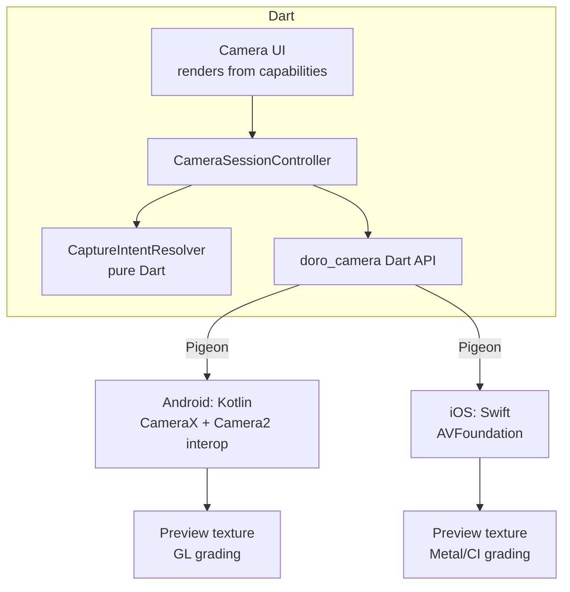
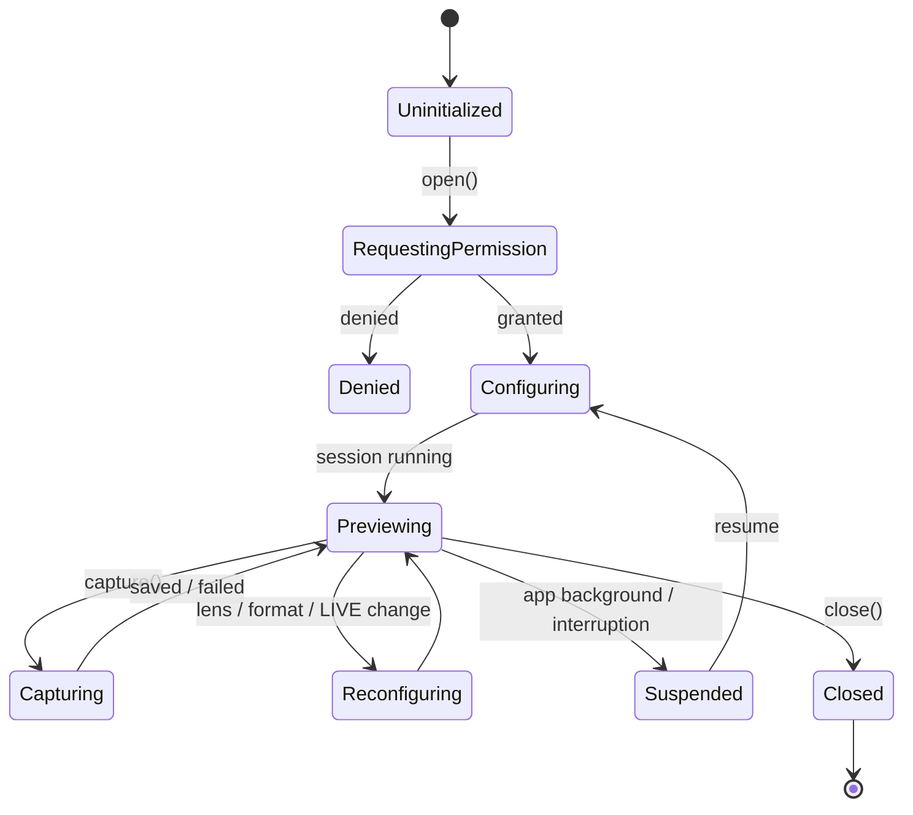

# Camera Architecture

Status: Accepted (pending spikes S1, S2, S3) · Last updated: 2026-09-30 · Related: ADR-0001, ADR-0002, ADR-0003, ADR-0004, ADR-0005, CAM-004, CAM-005, EXP-008

## Why a first-party plugin

The official Flutter `camera` plugin does not expose manual ISO, shutter, Kelvin white balance, manual focus, or physical lens selection, and community forks are stale or single-platform ([camera-apis.md](../research/camera-apis.md)). Doro Cam therefore owns `packages/doro_camera`: a Dart API plus native implementations (ADR-0001). The app is cross-platform at the **Dart** level. Hardware behavior is native and per-platform, and differences surface through capabilities, not `if (Platform.isIOS)` branches in app code.

## Component view



## Responsibilities

| Concern | Where | Notes |
|---|---|---|
| Enumerate cameras, probe capabilities | Native → mapped to Dart `CameraCapabilities` | Per **physical** camera (ADR-0002) |
| Choose settings (scenario, preset, manual) | Dart `CaptureIntentResolver` | Pure, exhaustively unit-tested |
| Clamp to capabilities, explain changes | Dart resolver | Output: `ResolvedCaptureSettings` + `List<Adjustment>` |
| Apply settings to hardware | Native | Reports *applied* values back via result metadata (CAM-050) |
| Preview rendering + live profile | Native GPU or Flutter shader | Decided by spike S2 |
| Full-resolution capture render | Native GPU/CPU | Applies the compiled LUT + effects (ADR-0004) |
| Motion pre/post buffering | Native | ADR-0005, spike S3 |
| Writing files | Native writes to the path Dart provides | Dart owns naming and the DB transaction |

## Session lifecycle



- A capture in flight when the app is backgrounded must complete writing to disk or be discarded atomically (CAM-053, NFR-002).
- Thermal state events (`nominal/fair/serious/critical`) are forwarded. At `serious`, LIVE buffering pauses. At `critical`, preview grading falls back to ungraded preview and the UI says why (NFR-012).

## Capability model (summary)

Full contract: [specs/camera.md](../specs/camera.md). Key rules:

- Capabilities are **ranges and sets**, not booleans. For example, ISO is `IntRange(min, max)`, not `supportsManualISO`. Booleans are derived getters (`hasManualIso => iso != null`).
- **Probed at runtime** from `CameraCharacteristics` / `AVCaptureDevice.formats`. Nothing is hardcoded per model. Device quirks, when discovered, go into a small, documented, tested *quirks table* keyed by manufacturer/model. They are recorded in [capability-matrix.md](../specs/capability-matrix.md).
- **Verified, not trusted:** after capture, the applied ISO and exposure time from the result metadata are compared with the request. A persistent mismatch (the device ignores manual keys) downgrades the capability for the session and is logged (S1 validates this on the Honor).
- Manual mode binds a **physical** lens. On iOS, virtual multi-camera devices switch lenses automatically and limit manual control. On Android, logical multi-cameras may expose physical IDs only on some devices.
- **Aperture** is almost always a single fixed value on phones. It is shown, and controllable only if more than one value is reported (CAM-013).

## Mode composition (ADR-0003)

The four "modes" are not four camera implementations. They are layers producing one `CaptureIntent`:

```
Experience defaults  (e.g. Instant: 1:1-ish frame, Instant Warm, flash auto)
  ⊕ Source layer     (Scenario recommendation | Preset | none)
  ⊕ Manual overrides (whatever the user touched in this session)
  → CaptureIntent    (requested values, possibly unsupported)
  → resolve(intent, capabilities) → ResolvedCaptureSettings + adjustments[]
```

- Later layers override earlier ones, field by field.
- "Custom mode" is simply saving the current merged intent as a Preset.
- Experience *constraints* (e.g. Film roll count, a fixed profile in an authentic mode) are validation rules applied in the resolver, not UI hacks.
- Assisted scenarios are data (a table of recommended ranges plus explanation strings), versioned in code, and unit-tested.

## Preview pipeline

Two candidate designs. **Spike S2 decides**, and the result becomes an ADR update:

| Option | How | Pros | Cons |
|---|---|---|---|
| A. Native GPU grading | Android: CameraX `CameraEffect`/`SurfaceProcessor` with a GLES shader applying the 3D LUT + grain/vignette → output surface → Flutter `Texture`. iOS: `AVCaptureVideoDataOutput` → Metal/Core Image → `CVPixelBuffer` → `FlutterTexture`. | Proven performance path; the same shader math is reused for video recording (P8) | Shader logic written twice (GLSL, Metal) |
| B. Flutter shader | Raw preview `Texture` + `ImageFilter.shader` (Impeller) running one GLSL fragment shader | One shader for both platforms | Unproven at 30 fps on a mid-range device; doesn't help capture or video rendering |

In either case, **capture rendering is native** and uses the same compiled LUT data as preview, which is how parity is achieved (PRF-009).

## Capture pipeline (still)

1. Dart calls `session.capture(CaptureRequest{ memoryId, assetIds, outputDir, format, renderProfile, live })`.
2. Native triggers capture with the resolved settings and receives the processed original (HEIF/JPEG, or DNG when RAW is enabled) plus result metadata.
3. Native writes the **original** unchanged (temp file → fsync → rename).
4. Native renders the **rendered** JPEG: original → LUT → effects → crop per aspect ratio → JPEG, with EXIF (orientation, time) and XMP (`doro:memoryId`). GPS is written only if location is enabled (PRIV-001).
5. Native generates a **thumbnail** and a **display** rendition (JPEG) so the server never has to decode HEIC ([media-pipeline.md](media-pipeline.md)).
6. Native returns `CaptureResult{ files, appliedSettings, timestamps, dimensions }`. Dart commits the Memory + assets in one drift transaction, then enqueues upload.

If steps 4–5 fail, the Memory is still saved with the original, and rendering is retried later. The original is never lost to a rendering failure.

## Performance and battery policy

- The preview stops when the camera route is not visible and when the app is backgrounded.
- LIVE ring buffering runs only while LIVE is on and the preview is visible (MOT-009).
- Capture rendering runs off the camera thread. The shutter button re-arms as soon as the sensor capture completes, not after rendering.
- Budgets (fps, shutter latency) are set from spike measurements (NFR-003, NFR-004). They are not invented here.
