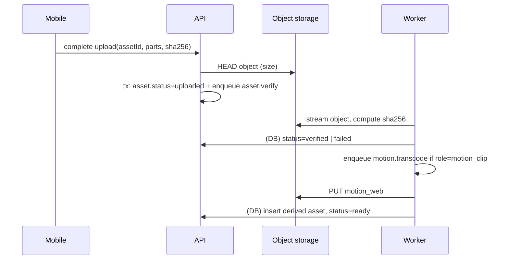

# Media Pipeline

Status: Accepted (pending spikes S3, S6) · Last updated: 2026-09-30 · Related: ADR-0004, ADR-0005, ADR-0008, ADR-0010, [specs/media.md](../specs/media.md)

## Asset roles

A Memory owns a set of immutable **assets**, each with a role:

| Role | Produced by | Format | Uploaded | Notes |
|---|---|---|---|---|
| `photo_original` | Device camera | HEIF or JPEG (DNG when RAW) | Always | Bit-exact; never modified |
| `photo_rendered` | Device (capture render) | JPEG | Always | Profile + effects + crop applied; what users see and share |
| `photo_display` | Device | JPEG, long edge 2048 px | Always | Fast viewing on web and mobile |
| `thumbnail` | Device | JPEG, long edge 512 px | Always | Library grids |
| `motion_clip` | Device (LIVE) | MP4/MOV: H.264 or HEVC video + AAC audio | Always | One container, so A/V sync is kept (ADR-0005) |
| `motion_web` | Worker | MP4 (H.264 + AAC, faststart) | Generated | Browser-compatible rendition |
| `video_original` | Device | MP4/MOV | Always (P8) | |
| `video_web` / `video_poster` | Worker | MP4 H.264 / JPEG | Generated (P8) | HLS deferred until needed |
| `sanitized_original` | Worker | Same format as original, GPS stripped | Generated on demand | Served to non-owners when location isn't shared (PRIV-002) |

## On-device vs worker

**Device generates everything it can.** It has hardware HEIC/HEVC decoders, and it avoids patent-encumbered decoding on the server (sharp/libvips prebuilt binaries cannot decode HEIC, per [image-processing.md](../research/image-processing.md)).

The **worker** handles:
- `asset.verify`: HEAD the object, check size, check the checksum (see [upload-sync.md](../specs/upload-sync.md)).
- `motion.transcode` / `video.transcode`: ffmpeg → H.264 MP4 faststart, audio AAC. Poster frame.
- `asset.sanitize`: strip GPS/location from EXIF/XMP (images) or the `©xyz`/location atoms (MP4/MOV), on demand.
- `derivative.fallback`: if a device upload lacks thumbnail or display (older client, failed render), derive them from `photo_rendered` (a JPEG, decodable by sharp).
- `memory.purge`: delete objects after trash expiry or account deletion.
- `export.build` (Post): zip archive of originals + metadata JSON.

Worker jobs are idempotent: they can safely run twice, and outputs are keyed deterministically.

## Processing flow

## Video and codec strategy

- **Originals keep their native codec.** iOS records HEVC in MOV; Android records H.264 or HEVC in MP4 depending on the device. We never re-encode originals.
- **Web renditions are H.264 MP4.** It is the universal browser baseline. HEVC browser support is uneven outside Safari. AV1 renditions can be added later if storage or bandwidth cost justifies it.
- **Resolution caps for renditions:** motion 1080p max, video 1080p (720p optional) at P8. HLS/adaptive streaming is added only if long videos make progressive MP4 insufficient (needs an ADR).
- Transcoding runs only in the worker, never in the API process (S6 validates isolation).

## Storage cost awareness

- Originals dominate storage. Renditions add roughly 10–20% for photos. Measure after P5; don't design around a guessed number.
- Per-user storage usage is tracked (`users.storage_bytes`, updated transactionally on asset state changes) for WEB-005 and future quotas.
- Egress matters because the product promise is original-quality sharing. The provider choice is weighed in [uploads-storage.md](../research/uploads-storage.md).
