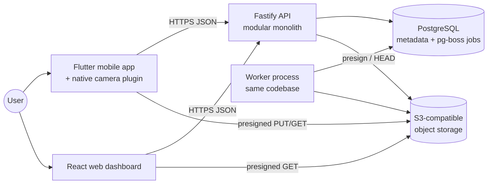

# Architecture Overview

Status: Accepted · Last updated: 2026-09-30 · Related: ADR-0001, ADR-0006, ADR-0008, ADR-0009, ADR-0010, ADR-0012

## System context

Media bytes never flow through the API. Clients upload and download directly to and from object storage with short-lived presigned URLs that the API issues **after** authorization (ADR-0008).

## Containers and responsibilities

| Container | Owns | Must not |
|---|---|---|
| **Flutter app — presentation** (`apps/mobile/lib/features/*/presentation`) | Screens, widgets, interaction, animation | Contain business rules or talk to platform channels directly |
| **Flutter app — application/domain** | Use cases; Memory, CaptureIntent, and preset logic; capability resolution | Depend on Flutter widgets or I/O |
| **Flutter app — data** | drift DB, upload queue, API client, file storage | Make UI decisions |
| **`doro_camera` plugin** (Kotlin/Swift) | Hardware: sessions, capability probing, preview texture, capture, GPU rendering, motion buffer | Hold product or business rules (e.g. scenario logic, presets) |
| **Fastify API** | Auth, authorization, metadata, upload orchestration, sync endpoints, business rules | Proxy media bytes; run heavy media processing inline |
| **Worker** | Async jobs: verify uploads, derivatives, transcodes, deletion, export, analytics rollups | Serve HTTP requests |
| **PostgreSQL** | Structured data, relationships, permissions, jobs queue | Store media blobs |
| **Object storage** | Originals, renditions, thumbnails, motion clips, exports | Be publicly listable or readable |
| **React web** | Library, sharing, and presets management UI; statistics | Replicate the camera; hold authorization logic (the server decides) |

Layer rules are enforced by folder structure and lint rules where possible (see [development-guide.md](../development/development-guide.md)).

## Key data flows

**Capture (offline-capable):** camera plugin writes original → app writes Memory + assets to drift in one transaction → UI confirms → upload queue entry created.

**Upload:** queue → `POST /v1/memories` (idempotent upsert) → `POST /v1/assets/{id}/uploads` → presigned URLs → direct PUT(s) → `POST …/complete` → API verifies size and checksum and enqueues a job in the same DB transaction → worker creates derivatives → asset `ready`. Full protocol: [upload-sync.md](../specs/upload-sync.md).

**View on web:** `GET /v1/memories?cursor=` → API authorizes, returns metadata with short-lived presigned rendition URLs → browser loads from storage.

## Technology stack

| Area | Choice | Decision record |
|---|---|---|
| Mobile | Flutter (Dart 3), Riverpod, go_router, drift, background_downloader | ADR-0001, ADR-0009 |
| Camera native | Kotlin + CameraX (Camera2 interop / raw Camera2 where needed); Swift + AVFoundation; Pigeon | ADR-0001 |
| Web | React, TypeScript, Vite, TanStack Query, React Router | ADR-0012 |
| API | Fastify, TypeScript, Zod type provider, @fastify/swagger | ADR-0006, ADR-0012 |
| Auth | Better Auth (self-hosted) | ADR-0011 |
| DB | PostgreSQL 17+, Drizzle ORM and migrations | ADR-0007 |
| Jobs | pg-boss | ADR-0010 |
| Media processing | On-device native; ffmpeg in the worker | ADR-0004, ADR-0005 |
| Storage | S3-compatible (MinIO locally; production provider is an open owner decision) | ADR-0008 |
| Tests | Vitest, Fastify inject, Testcontainers, Playwright, flutter_test, integration_test, JUnit, XCTest | [testing-strategy.md](../development/testing-strategy.md) |
| Infra | Docker, Docker Compose, GitHub Actions | ADR-0012 |

Versions are pinned by lockfiles when each package is scaffolded, not in this document.

## Scalability path

The MVP is designed for a solo developer and fewer than 1,000 users on a single host. Nothing here blocks growth:

| Scale | Change needed |
|---|---|
| 10 → 1,000 users | None. One API process, one worker, managed Postgres, one bucket. |
| 1,000 → 100,000 | Run several stateless API replicas behind a load balancer; scale workers separately (video transcoding is the main CPU consumer); add a CDN in front of renditions; Postgres read replica for analytics; partition `change_log` if large. |
| 100,000+ | Consider BullMQ/Redis or a dedicated queue if pg-boss throughput limits are measured (new ADR); split the media worker into its own deployable; move analytics to a separate store. Each needs an ADR. |

Components that already scale independently: the API (stateless), the worker (a separate process), object storage (managed), and the web app (static assets on a CDN).

## Boundaries that must not erode

1. Media bytes never pass through the API process.
2. Authorization lives only in the API. Clients hide UI, but the server enforces.
3. Native code has no product logic. Anything that isn't hardware-specific belongs in Dart.
4. The local drift DB is the mobile source of truth. The UI reads from it, never directly from the network.
5. Originals are immutable. Edits produce new derived assets or recipe changes.
