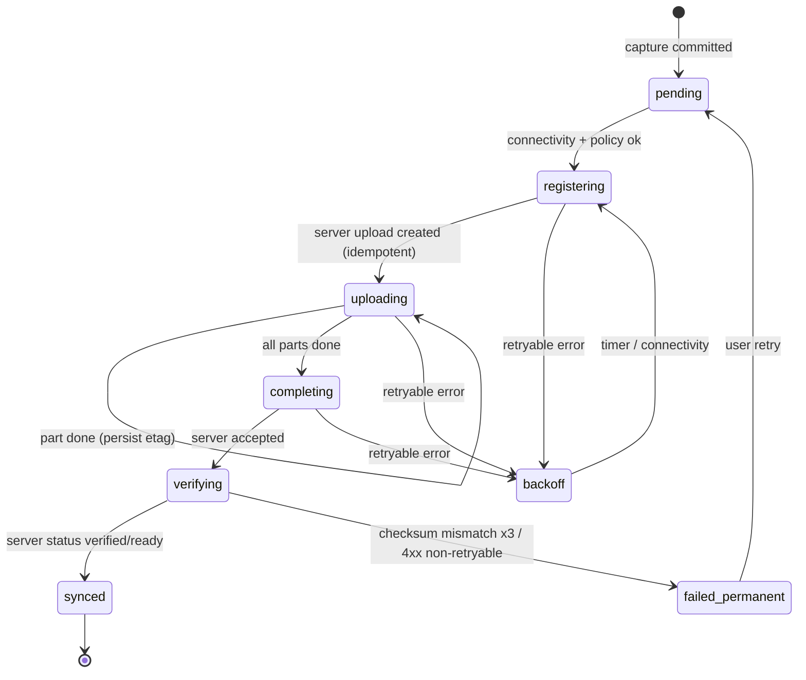

# Offline-First Synchronization

Status: Accepted (pending spikes S4, S5) · Last updated: 2026-09-30 · Related: ADR-0008, ADR-0009, SYNC-001–SYNC-008, NFR-001, NFR-002

## Principles

1. **The local drift DB is the source of truth on the device.** The UI reads only from it.
2. **IDs are client-generated** (UUIDv7) for Memories and assets, so offline-created entities never need re-keying and retries are idempotent.
3. **Media is immutable.** Only metadata can conflict, and media never needs merging.
4. **At-least-once delivery + idempotent server = effectively once.**
5. **Background work is best effort.** The OS decides; correctness never depends on background execution.

## Local schema (drift, planned)

| Table | Purpose | Key columns |
|---|---|---|
| `memories` | Local Memory records | `id` (UUIDv7), `kind`, `captured_at`, `captured_tz`, `experience_id`, `profile_ref`, `settings_json`, `caption`, `favorite`, `location_*` (nullable), `deleted_at`, `server_version`, `dirty_fields` |
| `assets` | Files belonging to Memories | `id`, `memory_id`, `role`, `local_path`, `bytes`, `sha256`, `mime`, `width`, `height`, `duration_ms`, `upload_state` |
| `upload_jobs` | Durable upload queue | `asset_id` (unique), `state`, `attempts`, `next_attempt_at`, `server_upload_id`, `part_size`, `last_error` |
| `upload_parts` | Multipart progress | `asset_id`, `part_number`, `etag`, `state` |
| `outbox` | Pending metadata mutations | `id`, `entity`, `entity_id`, `op`, `payload_json`, `created_at` |
| `sync_state` | Pull cursor, per account | `account_id`, `cursor` |
| `presets`, `settings` | Local configuration | — |

Schema changes use drift migrations with tests for every step (see [testing-strategy.md](../development/testing-strategy.md)).

## Upload state machine (per asset)

- Each transition is persisted **before** the side effect it authorizes is considered done. A restart resumes from the persisted state.
- Retryable: network errors, 5xx, 429 (respect `Retry-After`), expired presigned URL (re-presign). Non-retryable: 400/403/409 with a permanent code. These are surfaced in LIB-004 status.
- Backoff: exponential with full jitter, 5 s base, 30 min cap. Attempts are unbounded for retryable errors (the queue must never silently drop).
- Order: `photo_rendered`, `thumbnail`, and `photo_display` upload before `photo_original` and `motion_clip`, so the Memory is visible on the web quickly. The Memory metadata record is created first.
- Policy: Wi-Fi-only by default (SYNC-005); pause below a low-battery threshold unless charging.

## Background execution

| Platform | Mechanism | Limits |
|---|---|---|
| Android | `background_downloader` → WorkManager / user-initiated data transfer jobs | Runs after app kill; OEM battery managers (including Honor/MagicOS) may delay it. S4 verifies correctness on the emulator; OEM delays are field verification FV-005. |
| iOS | `background_downloader` → background `URLSession` upload tasks (file-based) | The system schedules tasks; each task is a whole request. Resumability comes from **per-part tasks** (see [upload-sync.md](../specs/upload-sync.md)). |

When the app is in the foreground, the queue runner also drives uploads directly.

## Metadata sync

**Push (outbox):** local edits (caption, favorite, delete, location toggle) write to `memories` and append an `outbox` op in the same transaction. The runner sends ops in order with `Idempotency-Key = op.id`. The server applies field-level updates with `If-Match: server_version`. On `409`, the client pulls and re-applies (see the conflict rules).

**Pull (P5 minimal, full in SYNC-006):** `GET /v1/sync/changes?cursor=…` returns changes since a monotonic server `change_seq`, including tombstones. The client upserts and advances the cursor in one transaction.

**Conflict rules:**
- Field-level last-writer-wins by server receipt order. The server assigns versions, so clients never trust their own clocks.
- Delete wins over edit. Restoring from trash is an explicit op.
- Assets never conflict (immutable). A duplicate upload of the same `assetId` is a no-op; a different `assetId` with an identical `sha256` for the same owner is deduplicated server-side by referencing the existing object (SYNC-004).

## Free-up-space (Post, LIB-005)

Only `synced` assets whose checksum was verified server-side may have local originals removed. Thumbnails and display renditions stay. Opening the original then downloads it on demand.
