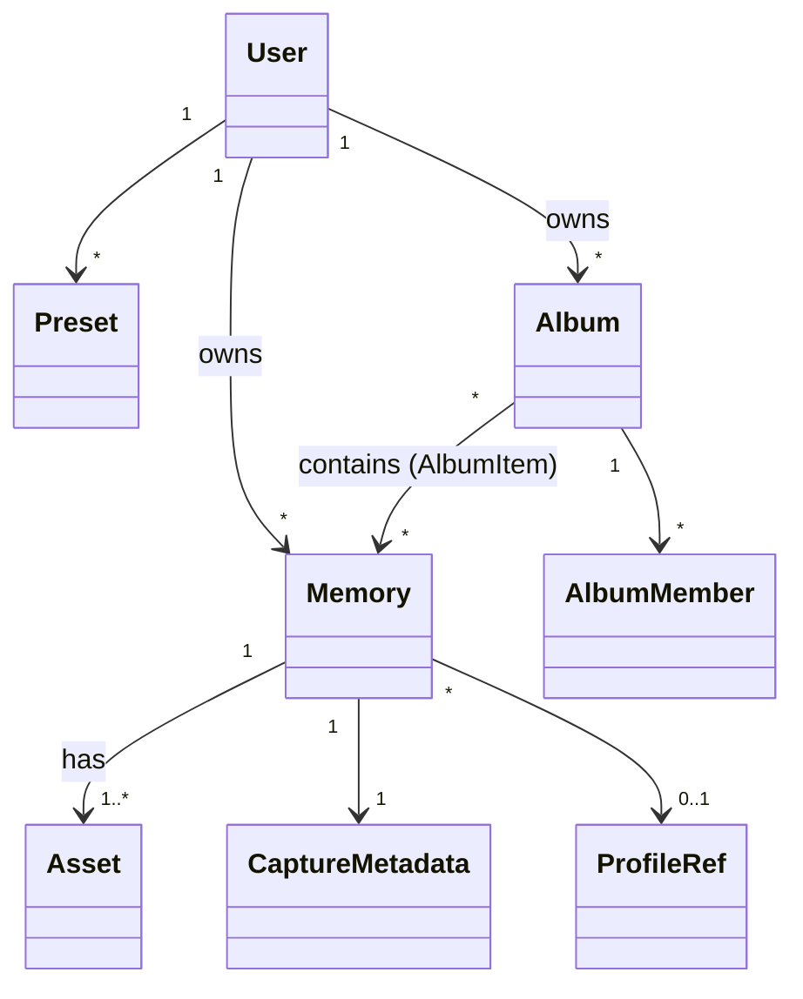

# Spec: Memory Domain Model

Status: Accepted · Last updated: 2026-09-30 · Related: MEM-001–MEM-008, PHY-001, ADR-0004, ADR-0005, ADR-0009

## Purpose

Define the core entities shared by mobile, API, and web, with their invariants. Physical storage is in [database.md](database.md) (server) and [sync.md](../architecture/sync.md) (device).

## Entities



### Memory (aggregate root)

| Field | Type | Notes |
|---|---|---|
| `id` | UUIDv7 | Client-generated; immutable |
| `ownerId` | UUID | Set when first uploaded; null while the device is anonymous |
| `kind` | `photo` \| `motion` \| `video` | `motion` = photo + motion clip |
| `capturedAt` | instant (UTC) | From the device clock at shutter |
| `capturedTz` | IANA zone + offset | Needed to show "shot at 21:00 local" correctly |
| `experienceId` | string | e.g. `mirrorless`, `instant` |
| `profileRef` | `{id, version}` \| null | Recipe applied to `photo_rendered` |
| `presetId` | UUID \| null | Preset used, if any (for analytics) |
| `scenario` | string \| null | Assisted scenario used, if any |
| `capture` | CaptureMetadata | See below |
| `location` | `{lat, lon, accuracyM, altitudeM?}` \| null | Only if enabled (PRIV-001) |
| `caption` | string ≤ 2,000 | |
| `tags` | string[] (Post) | |
| `favorite` | bool | |
| `aspectRatio` | e.g. `3:2` | Crop metadata. Originals are uncropped (CAM-044) |
| `publicHandle` | 22-char base62 random | Reserved for QR/NFC (MEM-008, PHY-001). Unique, non-guessable, never reused |
| `deletedAt` | instant \| null | Trash (MEM-007) |
| `version` | int | Server-assigned, incremented per change |

### CaptureMetadata (value object)

The **applied** values reported by the device (CAM-050), plus the requested values when they differ.

`deviceMake, deviceModel, platform, osVersion, appVersion, cameraId, lensKind (ultraWide|wide|tele|front|other), focalLengthMm, focalLength35mmEq, aperture, isoApplied, exposureTimeNsApplied, exposureBiasEv, whiteBalance {mode, kelvin?}, focus {mode, distanceDiopters?}, flash, zoomFactor, digitalZoom (bool), hdr, format, widthPx, heightPx, requested {…} (optional), adjustments [{field, requested, applied, reason}]`

The typed columns needed for analytics (focal length 35 mm eq, ISO, exposure time, aperture, lensKind, profile, experience) are extracted server-side (ADR-0007).

### Asset

| Field | Notes |
|---|---|
| `id` | UUIDv7, client-generated (or server-generated for worker-derived assets) |
| `memoryId` | |
| `role` | See [media-pipeline.md](../architecture/media-pipeline.md) |
| `mime`, `bytes`, `sha256` | Required for uploaded assets |
| `width`, `height`, `durationMs` | As applicable |
| `status` | `pending → uploading → uploaded → verified → ready` or `failed` |
| `storageKey` | Server only |

### ImageProfile / ProfileRef
Defined in [image-profile.md](image-profile.md). A Memory stores only `{id, version}` plus any user parameter overrides.

### Preset
`id, ownerId, name, experienceId, intent (partial CaptureIntent), profileRef, live (bool), createdAt, updatedAt, source (user|suggested)`. The intent is *partial*: unspecified fields fall through to the Experience defaults (ADR-0003).

### Album, AlbumMember, AlbumItem (P9)
Defined in [sharing.md](sharing.md).

## Invariants

1. A Memory has exactly one `photo_original`, except `video` Memories, which have exactly one `video_original`.
2. `kind = motion` ⇔ exactly one `motion_clip` asset exists.
3. Assets are immutable once `uploaded`. A changed rendering is a **new** asset, and the old one is superseded, not overwritten.
4. `id` and `publicHandle` never change.
5. `capturedAt` is immutable. There is no "fix date" feature in the MVP.
6. A Memory in trash (`deletedAt != null`) is excluded from library and album listings and is purged 30 days later.
7. Location fields are all null or all present.

## Lifecycle

```
captured (local) → registered (server knows metadata) → assets syncing → synced
        ↘ trashed → purged
```

## Acceptance criteria

- The Dart domain types and server Zod schemas implement exactly these fields. A contract test compares the generated OpenAPI with the Dart client model.
- Invariants 1–3 and 7 are enforced by both client domain constructors and server validation, with tests.
